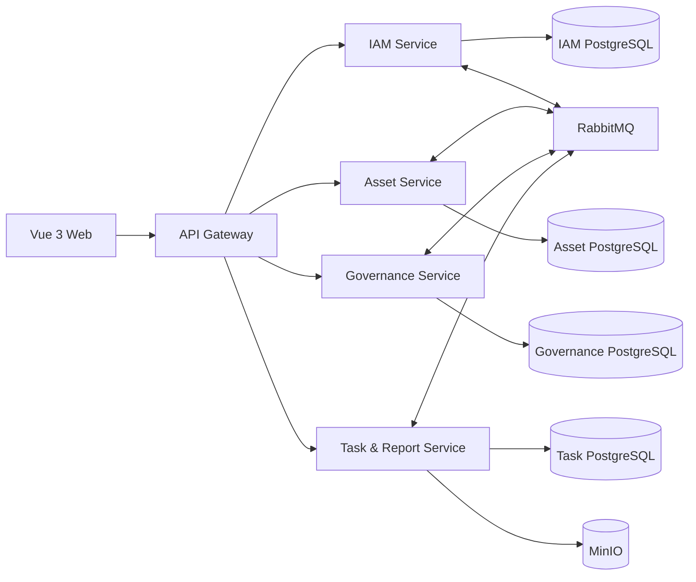

# 资产治理平台工程化改造计划

> 文档状态：初版
> 规划周期：12 个月
> 改造策略：旧系统短期止血，新平台整体重构，一次性迁移历史数据
> 目标技术栈：Go 微服务、PostgreSQL、RabbitMQ、MinIO、Vue 3 + TypeScript

## 1. 背景与总体目标

当前系统已经具备七类资产的认证、CRUD、分页搜索、CSV 导入导出、软删除和基础统计能力，适合作为内部试用版。继续简单增加台账页面会快速放大字段重复定义、安全边界薄弱、数据库无法演进和运维能力不足等问题。

本次改造的总体目标是把系统从“七类资产 CRUD 应用”升级为“可扩展、可审计、可运维的资产治理平台”，并在一年内形成以下核心能力：

- 通过版本化资产 Schema 和代码生成降低新增资产类型的开发成本。
- 通过统一身份、数据权限和审计体系保证所有入口的授权一致性。
- 通过任务中心承载大批量导入、导出、统计和报表任务。
- 通过审批、版本、风险整改和资产关系形成治理闭环。
- 通过自动化测试、可观测性、备份恢复和标准部署实现可持续交付。

改造期间不要求兼容旧 API，但必须提供 SQLite 到 PostgreSQL 的一次性、可校验、可重复执行的数据迁移工具。旧系统在新平台切换前保留运行，只接受安全阻断项和严重正确性问题修复。

## 2. 当前问题与整改映射

| 编号 | 优先级 | 当前问题 | 主要风险 | 整改阶段 | 验收方式 |
|---|---|---|---|---|---|
| SEC-01 | P0 | 创建、更新接口把客户端 JSON key 拼入 SQL | 任意列写入、系统字段越权、SQL 标识符注入 | 第 1 月 | 未知字段及 `id/created_by/is_deleted` 返回 400；SQL 只使用生成的固定字段 |
| SEC-02 | P0 | 资产字段直接写入 `innerHTML` | 持久化 XSS，结合本地 Token 可扩大影响 | 第 1 月 | HTML、事件属性按纯文本展示；启用 CSP；安全测试通过 |
| SEC-03 | P0 | JWT 密钥和默认管理员硬编码 | 密钥泄漏、默认口令、令牌不可控 | 第 1–3 月 | 密钥外置；无固定密码；短 Token、刷新轮换及注销生效 |
| SEC-04 | P0 | 登录无限流、Logout 不使 Token 失效 | 暴力破解和失窃令牌持续有效 | 第 1–3 月 | 登录限流、失败锁定、刷新令牌撤销及复用检测通过 |
| COR-01 | P1 | 高风险漏洞统计用文本匹配整数编码，且参数错误被忽略 | 看板数据错误 | 第 1 月 | 已知样本统计结果准确，所有数据库错误均被处理 |
| COR-02 | P1 | 查询、扫描和 `rows.Err()` 错误大量被忽略 | 静默错误、空指针和错误统计 | 第 1 月 | 故障注入返回标准错误，不 panic、不返回伪成功 |
| COR-03 | P1 | “是/否”转换发生在条件校验前，校验仍比较字符串 | 条件必填可绕过 | 第 1 月 | 外部接口为“是”时，缺少范围必须拒绝 |
| COR-04 | P1 | 布尔值在后端被转成中文文本，前端按字符串真值判断 | “否”可能显示成“是” | 第 1 月 | true/false、0/1、“是/否”契约统一且展示正确 |
| IMP-01 | P1 | CSV 导入不复用业务校验 | 无效枚举、日期和业务组合进入数据库 | 第 1–2 月 | API 与导入使用同一校验器，非法记录进入错误报告 |
| IMP-02 | P1 | 导入 `io.ReadAll` 无限制、逐行提交、不可回滚 | 内存耗尽、部分写入、失败难恢复 | 第 1 月止血，第 5–6 月重构 | 上传有限额；新平台流式处理、批次化、幂等、可重试 |
| AUTH-01 | P1 | 文档、API 和前端对填报员权限理解不一致 | 越权或大量 403，统计口径不一致 | 第 1–3 月 | 权限矩阵覆盖列表、详情、统计、导入、导出和任务 |
| ARCH-01 | P1 | Model、SQL、校验、枚举、导入配置和前端表单重复定义 | 字段语义漂移，新增类型改动面大 | 第 3–4 月 | 单一 Schema 生成 Go、OpenAPI、TypeScript 和 UI 元数据 |
| DB-01 | P2 | 只有 `CREATE TABLE IF NOT EXISTS`，无版本化迁移和关键索引 | 升级不可控，数据增长后查询退化 | 第 2–4 月 | 每次发布包含可追踪迁移，索引由查询和压测验证 |
| OPS-01 | P2 | 无健康检查、优雅停机、HTTP 超时、结构化日志和指标 | 故障不可发现、不可定位 | 第 2 月建立基线，第 10–12 月完善 | 健康检查、请求链路、告警和故障演练通过 |
| AUD-01 | P2 | 只有操作日志表，没有写入和防丢机制 | 无法追责和还原变更 | 第 7–9 月 | 关键操作通过 Outbox 可靠进入审计记录 |
| DR-01 | P2 | 只有备份目录，没有备份恢复实现和演练 | 数据丢失后无法恢复 | 第 10–12 月 | 完成 PostgreSQL/MinIO 备份恢复演练并记录 RPO/RTO |
| DEV-01 | P2 | 无 CI/CD、契约检查和持续安全扫描 | 回归依赖人工发现 | 第 1–2 月 | 合并请求自动执行测试、构建、扫描和契约校验 |

现有问题的主要代码证据位于：

- `internal/handlers/assets_all.go`：动态字段 SQL、通用 CRUD 和布尔转换。
- `internal/handlers/import.go`、`internal/handlers/stats.go`：导入与统计正确性。
- `web/js/assets/utils/table-renderer.js`、`web/js/auth.js`：DOM 渲染和 Token 存储。

## 3. 改造原则与范围

### 3.1 设计原则

1. **单一事实源**：资产字段定义只存在于版本化 Schema，生成物禁止手工修改。
2. **默认安全**：未知字段拒绝、最小权限、输出转义、密钥外置、操作可审计。
3. **数据所有权明确**：每个服务独占自己的数据，禁止跨服务直连数据库或跨库 JOIN。
4. **同步命令、异步事件**：即时结果使用 REST，长任务和跨服务传播使用 RabbitMQ。
5. **可靠事件**：生产方使用 Transactional Outbox，消费方使用 Inbox/幂等键。
6. **迁移显式可审查**：不在运行时自动修改表结构；正式迁移必须进入代码评审。
7. **先粗粒度再拆分**：不按七类资产拆服务，避免为了微服务而微服务。
8. **可量化验收**：每个阶段必须有测试、性能、迁移或运维指标作为退出条件。

### 3.2 首年不纳入范围

- SaaS 多租户和租户计费。
- 原生移动端。
- 跨地域多活和异地双活数据库。
- 完全动态 EAV 数据模型。
- 为兼容旧客户端长期维护两套 API。
- 按单一资产类型或单一报表拆分更多微服务。

## 4. 目标架构



### 4.1 服务职责

| 组件 | 责任 | 明确不负责 |
|---|---|---|
| `gateway` | `/api/v1` 统一入口、CORS、CSP、限流、请求 ID、认证转发、错误规范化 | 业务数据持久化和领域决策 |
| `iam-service` | 用户、角色、部门、数据范围、登录、刷新、注销、会话和密钥轮换 | 资产记录和审批流程 |
| `asset-service` | 资产类型 Schema、七类资产、搜索、资产版本、软删除/恢复、资产关系 | 文件任务、通知和审批状态机 |
| `governance-service` | 审批、风险评分、整改、复测、SLA、审计读模型 | 直接修改资产服务数据库 |
| `task-report-service` | 导入、导出、统计读模型、报表、任务重试和进度 | 用户认证和资产主数据所有权 |
| `web` | 配置驱动表单、权限路由、任务进度、审批和统计界面 | 在浏览器保存长期敏感令牌 |

四个领域服务初期使用同一 PostgreSQL 集群，但分别使用独立数据库或独立 Schema 和独立数据库账号。服务间数据同步通过事件完成；报表服务维护面向查询的读模型。

### 4.2 Monorepo 建议结构

```text
asset-governance/
├── api/                     # OpenAPI 与事件契约
├── schemas/assets/          # 七类资产 Schema 单一事实源
├── services/
│   ├── gateway/
│   ├── iam/
│   ├── asset/
│   ├── governance/
│   └── task-report/
├── web/                     # Vue 3 + TypeScript
├── tools/
│   ├── schema-gen/          # Schema 编译与代码生成
│   └── sqlite-migrate/      # 历史数据迁移 CLI
├── deploy/
│   ├── compose/
│   └── kubernetes/
├── migrations/              # 按服务分目录的人工审核迁移
└── docs/                    # ADR、权限矩阵、运行手册
```

Go 服务统一使用 Gin、`pgx/v5`、`sqlc` 和版本化 SQL migration；公共目录只共享日志、追踪、配置等平台能力，领域模型通过 OpenAPI 或事件契约生成，禁止直接共享数据库实体。

## 5. 元数据驱动的资产引擎

### 5.1 Schema 作为单一事实源

七类资产分别存放于 `schemas/assets/*.yaml`。每份 Schema 至少定义：

- `type`、`title`、`version` 和目标表名。
- 字段名、中文标签、数据类型、长度、精度和默认值。
- 必填、枚举、格式、范围和条件校验。
- 是否可搜索、排序、筛选、导入和导出。
- 数据权限、字段可见性和脱敏策略。
- 表单分组、控件、列表列和帮助文本。
- Schema 兼容级别和迁移说明。

示意结构：

```yaml
type: system-info
title: 信息系统清单
version: 1
storage:
  table: system_info_assets
fields:
  - name: system_name
    label: 系统名称
    type: string
    required: true
    maxLength: 200
    searchable: true
    list: true
  - name: has_external_interface
    label: 是否与外部系统对接
    type: boolean
    required: true
  - name: interface_scope
    label: 对接范围和方式
    type: string
    requiredWhen: "has_external_interface == true"
```

条件表达式只允许访问当前 DTO 中的白名单字段和预置函数，不允许执行 SQL、脚本或网络调用。

### 5.2 代码生成产物

`schema-gen` 对 Schema 完成语法、命名、枚举和兼容性校验后生成：

- Go Create、Update、Response DTO。
- 字段白名单、枚举、条件校验器和 OpenAPI Schema。
- `sqlc` 查询输入或安全 repository 模板，SQL 标识符只来自编译期 Schema。
- TypeScript 类型、API 客户端和前端字段元数据。
- Vue 表单、列表、搜索、导入和导出配置。
- 数据库迁移草案和索引建议。

生成文件带有“禁止手工编辑”标记，并在 CI 中重新生成后检查工作区无差异。复杂迁移必须由开发者根据草案编写正式 SQL 并评审。

### 5.3 Schema 演进规则

- 新增可选字段为向后兼容变更。
- 新增必填字段必须提供默认值或数据回填迁移。
- 枚举值只能新增；删除或改义必须提供旧值映射。
- 字段重命名通过“新增字段—回填—双读—切换—删除”完成。
- Schema 版本、数据库迁移版本和 OpenAPI 版本必须在发布记录中建立关联。
- 首版所有资产使用强类型 PostgreSQL 表，不采用 EAV，也不把所有业务字段放入 JSON。

## 6. API、权限与安全约定

### 6.1 首版公共 API

| 领域 | API |
|---|---|
| 认证 | `POST /api/v1/auth/login`、`POST /refresh`、`POST /logout`、`GET /me` |
| 类型 | `GET /api/v1/asset-types`、`GET /api/v1/asset-types/{type}/schema` |
| 资产 | `GET/POST /api/v1/assets/{type}`、`GET/PUT/DELETE /{id}`、`POST /{id}/restore` |
| 导入 | `POST /api/v1/import-jobs`、`POST /{id}/validate`、`POST /{id}/commit`、`GET /{id}` |
| 导出 | `POST /api/v1/export-jobs`、`GET /{id}`、`GET /{id}/download` |
| 报表 | `GET /api/v1/reporting/*` |
| 流程 | `POST/GET /api/v1/workflows/*` |
| 风险 | `POST/GET /api/v1/risks/*` |

所有接口使用统一错误结构，至少包含 `code`、`message`、`request_id` 和可选 `details`。创建成功返回 201，异步任务返回 202，校验错误返回 400，认证失败返回 401，权限不足返回 403，资源不存在返回 404，版本冲突返回 409。

### 6.2 认证默认值

- JWT 使用 RS256 和算法白名单，Access Token 有效期固定为 15 分钟。
- Access Token 仅保存在前端内存状态中，不写入 `localStorage` 或 `sessionStorage`。
- Refresh Token 使用 HttpOnly、Secure、SameSite Cookie，服务端只保存哈希。
- 每次刷新执行 Token 轮换；旧 Token 再次使用时撤销整个会话族。
- Logout 撤销当前会话；禁用用户或修改关键权限后立即撤销其刷新会话。
- Bootstrap 管理员通过部署密钥或一次性初始化命令创建，首次登录强制修改密码。
- 登录默认按“IP + 用户名”每分钟最多 5 次失败尝试；阈值配置化并记录安全日志。
- JSON 请求体默认限制为 1 MiB，导入文件默认限制为 50 MiB，均可通过受控配置调整。

### 6.3 权限模型

首版角色固定为：

| 能力 | 填报员 | 审核员 | 审计员 | 管理员 |
|---|---:|---:|---:|---:|
| 查看授权范围内资产 | 是 | 是 | 是 | 是 |
| 新增和修改草稿 | 是 | 否 | 否 | 是 |
| 提交审批 | 是 | 否 | 否 | 是 |
| 审批和驳回 | 否 | 是 | 否 | 是 |
| 查看完整审计记录 | 否 | 否 | 是 | 是 |
| 软删除和恢复 | 否 | 否 | 否 | 是 |
| 导入 | 是，限授权范围 | 否 | 否 | 是 |
| 导出 | 需具备单独导出权限 | 需具备单独导出权限 | 是 | 是 |
| 用户、角色、Schema 管理 | 否 | 否 | 否 | 是 |

数据范围使用角色与属性结合的 ABAC 判断，至少包含本人、所属部门、下属部门和全局四级。列表、详情、统计、导入、导出、流程和后台任务必须调用同一授权策略，禁止只在前端隐藏按钮。

## 7. 跨服务一致性与任务模型

### 7.1 事件与可靠投递

- 服务在业务事务内同时写领域数据和 Outbox 记录。
- 独立发布器将 Outbox 事件投递至 RabbitMQ，成功后记录投递时间。
- 消费者以 `event_id` 写 Inbox，已处理事件直接确认，确保至少一次投递下的业务幂等。
- 消费失败使用指数退避，超过阈值进入死信队列并产生告警。
- 事件包含 `event_id`、`event_type`、`occurred_at`、`producer`、`schema_version`、`trace_id` 和业务载荷。
- 跨服务操作不使用分布式数据库事务；需要补偿的流程由状态机或 Saga 明确记录。

首批事件包括：用户禁用、资产创建、资产更新、资产删除、资产恢复、审批通过、风险创建、整改完成、导入批次完成。

### 7.2 导入任务

导入流程固定为：上传文件到 MinIO、创建任务、流式解析、字段映射、统一业务校验、生成预检报告、用户确认、分批写入资产服务、汇总结果。

- 使用文件摘要和调用方提供的幂等键防止重复任务。
- 每批写入必须原子提交；失败批次可重试，已成功批次不重复写入。
- 任务状态为 `pending/running/waiting_confirmation/succeeded/partially_succeeded/failed/cancelled`。
- 错误报告包含行号、字段、错误码、错误信息，不回显数据库内部错误。
- 10 万行场景必须保持流式处理，不把完整文件或全部记录加载到内存。

## 8. 十二个月实施路线

### 8.1 月度安排总览

| 月份 | 当月主题 | 核心工作 | 当月退出条件 |
|---|---|---|---|
| 第 1 月 | 旧系统安全止血 | 修复字段注入与系统字段越权、持久化 XSS、Token 存储、JWT 密钥与算法、固定管理员密码、登录限流、统计错误和导入校验绕过；明确旧系统 RBAC | P0 安全问题有回归测试，七类资产未知字段均被拒绝，旧系统可安全维持迁移期运行 |
| 第 2 月 | 工程基线与新架构骨架 | 建立 Monorepo、网关与四个服务模板、Vue 3 工程、Compose、OpenAPI、统一错误模型、日志、请求 ID、健康检查和 CI | 新架构在 Compose 中一键启动，旧系统进入功能冻结，CI 基线全部通过 |
| 第 3 月 | IAM 服务 | 实现用户、角色、部门数据范围、短期 Access Token、Refresh Token 轮换、注销与重复使用检测 | 登录、刷新、注销、禁用和权限变更通过安全与契约测试 |
| 第 4 月 | 元数据资产引擎 | 完成 YAML Schema、编译器、代码生成和兼容性检查；先打通一个资产类型，再覆盖七类资产 | 七类资产由 Schema 驱动，Go、OpenAPI、TypeScript 与 Vue 元数据生成结果一致 |
| 第 5 月 | 任务中心与导入导出 | 建立 RabbitMQ Outbox/Inbox、任务状态机、流式导入预检、批次提交、错误报告和异步导出 | 任务可观测、可重试、可取消且幂等，10 万行文件不整表载入内存 |
| 第 6 月 | 历史数据迁移 | 完成 SQLite→PostgreSQL 迁移 CLI、枚举清洗、dry-run、对账、重复执行和切换演练 | 样本迁移数量、枚举与关键字段一致，形成正式切换与回滚报告 |
| 第 7 月 | 资产审批闭环 | 建立草稿、审核、发布、驳回、停用状态机，以及乐观锁、审批意见和待办 | 审批主流程和越权场景具备端到端测试 |
| 第 8 月 | 版本、风险与整改 | 实现字段 Diff、历史版本、受控恢复、风险评分、整改、复测、风险接受和 SLA | 任意变更可追溯，风险从发现到关闭形成完整闭环 |
| 第 9 月 | 资产关系与影响分析 | 建立系统、设备、数据、漏洞、供应商和责任部门关系，提供基础影响范围分析 | 关键关系可维护、可查询，并能回答下线、供应链和漏洞影响范围 |
| 第 10 月 | 查询性能与读模型 | 建立统计读模型、全文搜索、组合索引、压测场景和容量基线 | 10 万资产、50 并发读取时列表接口 P95 不高于 500 ms |
| 第 11 月 | 可观测性与可靠性 | 接入 OpenTelemetry、Prometheus、Grafana、集中日志和告警；实施 PostgreSQL/MinIO 备份恢复演练 | 请求链路可追踪，核心告警可触发，备份可恢复并有演练证据 |
| 第 12 月 | Kubernetes 与生产交付 | 完成 K8s 清单、迁移 Job、滚动发布、资源限制、回滚手册、ADR、API/事件目录和年度总结 | 可从干净环境部署，滚动发布与回滚演练通过生产验收清单 |

以下阶段说明给出跨月协作关系和阶段级验收要求；实施时仍按上表逐月验收，并在 `改造状态.md` 留存证据后再进入下一个月。

### 阶段一：第 1–2 月——旧系统止血与工程基线

主要交付：

- 修复动态 SQL、持久化 XSS、硬编码密钥、默认密码、统计和条件校验问题。
- 为旧导入增加文件大小限制、统一校验和清晰的部分成功语义。
- 输出并实现统一 RBAC 矩阵，前端不再为无权限角色显示删除操作。
- 建立新 Monorepo 骨架、五个 Go 进程模板、Vue 工程和 Compose 环境。
- 建立 OpenAPI、统一错误模型、结构化日志、请求 ID、配置校验和健康检查。
- 建立 CI：格式化、单测、集成测试、代码生成一致性、依赖和安全扫描。

退出条件：所有 P0 问题有自动化回归测试；Compose 可一键启动 PostgreSQL、RabbitMQ、MinIO、网关、IAM 和前端；旧系统进入功能冻结。

### 阶段二：第 3–4 月——IAM 与元数据资产引擎

主要交付：

- 完成 IAM、会话轮换、用户禁用、角色和部门数据范围。
- 完成 Schema 格式、编译器、兼容性检查和生成流水线。
- 选择“责任部门”作为首个端到端类型，验证生成 DTO、表单、API、导入和迁移。
- 按“责任部门→供应链→漏洞→软硬件→软件统计→数据资产→信息系统”的顺序迁移七类资产。
- 建立资产软删除、恢复、乐观锁和基础版本记录。

退出条件：七类资产均由 Schema 驱动；未知字段无法进入 SQL；Go、OpenAPI、TypeScript 生成结果在 CI 中一致。

### 阶段三：第 5–6 月——任务中心、导入导出与数据迁移

主要交付：

- 实现 RabbitMQ Outbox/Inbox、任务状态机、进度、重试、取消和死信处理。
- 实现流式导入预检、确认提交、错误报告、批次幂等和异步导出。
- 实现 SQLite→PostgreSQL 迁移 CLI，支持 dry-run、枚举修正、错误清单和重复执行。
- 建立按资产类型、部门和权限过滤的统计读模型。

退出条件：10 万行导入通过容量测试；迁移样本数量与关键字段校验一致；任务重试不产生重复数据。

### 阶段四：第 7–9 月——治理流程、风险和关系

主要交付：

- 建立草稿、待审核、已发布、已驳回、已停用的资产状态机。
- 建立字段 Diff、审批意见、历史版本和受控恢复。
- 建立风险评分、责任人、整改期限、复测、风险接受和 SLA 超期升级。
- 建立资产关系表，支持系统、设备、数据、漏洞、供应商和责任部门之间的关系。
- 实现基础影响分析：设备下线影响、供应商影响范围和漏洞爆炸半径。
- 通过可靠事件形成不可遗漏的审计读模型。

退出条件：核心流程具备端到端测试；任意资产变更可追踪到操作者、前后值、流程和请求链路。

### 阶段五：第 10–12 月——性能、可观测与生产交付

主要交付：

- 完成统计读模型、全文搜索、索引调优、容量测试和性能基线。
- 接入 OpenTelemetry、Prometheus、Grafana 和集中日志，建立关键告警。
- 完成 PostgreSQL 与 MinIO 定时备份、恢复脚本和演练报告。
- 提供 Kubernetes 配置、滚动发布、数据库迁移 Job、资源限制和回滚手册。
- 补齐 ADR、OpenAPI、事件目录、运行手册、安全说明和年度项目总结。

退出条件：达到性能目标；完成故障与恢复演练；可从干净环境部署并通过生产验收清单。

## 9. SQLite 历史数据迁移与切换

### 9.1 迁移工具要求

`sqlite-migrate` 作为独立 Go CLI，支持：

- `--dry-run`：只读取、转换和校验，不写 PostgreSQL。
- `--asset-type`：按资产类型分批迁移。
- `--resume-from`：从断点恢复。
- `--report`：输出数量、字段错误、枚举映射和失败记录。
- 幂等键固定为 `legacy_type + legacy_id`。
- 将旧整数/文本枚举统一映射到新 Schema 定义。
- 对 `cross_border/is_cross_border`、`has_media_platform` 等已知漂移字段使用显式映射规则，不静默猜测。

迁移工具不得修改源 SQLite 文件。读取正式数据前必须备份数据库、WAL 和 SHM 文件，并在维护窗口执行 WAL checkpoint。

### 9.2 正式切换步骤

1. 公告维护窗口，停止旧系统写入。
2. 执行 SQLite WAL checkpoint，备份数据库和现有上传文件。
3. 对最终备份执行 migration dry-run，归零阻断性错误。
4. 执行正式迁移，记录工具版本、Schema 版本和运行参数。
5. 对比每类资产记录数、关键字段摘要、枚举分布、软删除数量和抽样数据。
6. 执行认证、权限、CRUD、导入、统计和审批冒烟测试。
7. 将入口流量切换至新网关，并观察错误率、延迟和任务积压。
8. 旧系统和备份保留只读，达到观察期后再归档。

回滚条件包括：迁移数量不一致、关键字段校验失败、核心 API 冒烟失败、错误率超过阈值或数据写入异常。触发回滚时停止新平台写入，恢复旧二进制和 SQLite 备份，并保留新平台日志用于分析，不进行反向自动同步。

## 10. 测试、质量门禁与验收指标

### 10.1 自动化测试

- **单元测试**：Schema 解析、兼容性、校验表达式、权限策略、风险计算和状态机。
- **Golden Test**：固定 Schema 生成的 Go、OpenAPI、TypeScript、UI 元数据和 SQL 草案保持稳定。
- **集成测试**：使用隔离 PostgreSQL、RabbitMQ、MinIO 验证事务、Outbox、重试、死信和幂等。
- **契约测试**：OpenAPI 校验请求和响应；生成的 Go/TypeScript 客户端必须可编译。
- **安全测试**：未知字段、系统字段、XSS、弱口令、刷新令牌复用、越权和上传限制。
- **迁移测试**：使用匿名化 SQLite 样本验证数量、枚举、日期、布尔和已知漂移字段。
- **端到端测试**：Playwright 覆盖登录、七类资产、导入、审批、权限、风险和导出。
- **性能测试**：k6 覆盖列表、搜索、统计和任务提交；单独测试 10 万行导入。
- **恢复测试**：验证 PostgreSQL 和 MinIO 从备份恢复后的一致性和可用性。

### 10.2 必须通过的回归场景

1. 提交未知字段、`id`、`created_by`、`is_deleted` 返回 400。
2. 提交包含 `` 等内容时只显示文本，浏览器不执行事件处理器。
3. 外部接口为“是”且缺少对接范围时，API 和导入都拒绝数据。
4. 高风险漏洞编码为 0 时统计结果正确；数据库失败返回标准错误。
5. 填报员、审核员、审计员和管理员在列表、详情、统计、导入、导出中的权限一致。
6. Access Token 不出现在浏览器持久化存储；Logout 后 Refresh Token 不可再次使用。
7. 重复发布同一事件或重复提交同一导入任务不会产生重复记录。
8. 迁移工具重复运行结果不变，失败记录可定位到资产类型和旧 ID。

### 10.3 量化验收指标

- 数据规模：至少验证 10 万条资产记录。
- 读取性能：10 万资产、50 并发读取时，核心列表 API P95 不高于 500 ms。
- 导入能力：10 万行文件流式处理，可查看进度、失败可重试，进程内存不随总行数线性增长。
- 可靠性：关键领域事件无静默丢失，重复事件不产生重复副作用。
- 迁移质量：各类型记录数一致，关键枚举和布尔字段映射 100% 可解释。
- 可恢复性：备份恢复演练记录实际 RPO/RTO；首年目标为 RPO 不高于 24 小时、RTO 不高于 2 小时。

### 10.4 CI 质量门禁

每次合并请求必须执行：

- Go/TypeScript 格式化和静态检查。
- 单元测试、必要的集成测试和 Playwright 冒烟测试。
- Schema 校验与代码生成无差异检查。
- OpenAPI 破坏性变更检测。
- 依赖漏洞、密钥泄漏、SAST 和容器镜像扫描。
- 所有服务及前端的可复现构建。

## 11. 可观测性、备份与发布

- 所有请求携带 `request_id` 和 trace context，日志使用结构化 JSON。
- 通过 OpenTelemetry 汇聚网关、HTTP、数据库、RabbitMQ 和任务链路。
- Prometheus 至少采集请求量、错误率、P95/P99、数据库连接、队列深度、死信数量、任务耗时和 Outbox 延迟。
- Grafana 提供服务健康、任务中心、消息积压、数据库和业务指标看板。
- 健康接口分为 liveness、readiness；服务关闭时先停止接收流量，再等待请求和任务安全结束。
- PostgreSQL 使用逻辑备份与受控物理备份策略；MinIO 开启版本或对象生命周期策略。
- Compose 用于本地和集成环境；Kubernetes 用于最终交付，迁移以独立 Job 执行，禁止多个实例并发迁移。
- 发布采用向后兼容数据库变更、滚动部署和明确回滚版本；破坏性字段删除至少跨两个发布周期。

## 12. 主要风险与控制措施

| 风险 | 控制措施 |
|---|---|
| 微服务基础设施占用过多开发时间 | 保持四个粗粒度领域服务；前两个月只搭建必要能力，不自研消息队列、网关或存储 |
| Schema 生成器演变成难维护的通用低代码平台 | 首年只服务现有七类资产；生成目标和表达式能力采用白名单，不支持任意脚本 |
| 跨服务数据查询困难 | 业务写模型归属明确；统计服务通过事件维护读模型，不跨库 JOIN |
| 旧数据质量不足导致迁移失败 | 提前运行 dry-run，建立显式字段映射、错误报告和人工修复流程 |
| RabbitMQ 至少一次投递导致重复副作用 | 强制 Outbox/Inbox、事件 ID、业务幂等键和重复消费测试 |
| 新旧系统重构周期过长 | 首先修复旧系统 P0；按资产类型逐个完成端到端能力，阶段成果可演示 |
| Kubernetes 掩盖核心业务目标 | 只在后期引入，前期统一使用 Compose 完成开发和测试 |

## 13. 年度完成定义

满足以下条件后，本年度改造视为完成：

- 七类资产均由版本化 Schema 驱动，新增一种资产不再同步修改多份字段定义。
- 旧系统 P0/P1 关键问题均有修复或已随切换淘汰，并有回归测试覆盖。
- IAM、资产、治理、任务报表四个服务和网关按数据所有权独立运行。
- SQLite 历史数据完成可审计迁移，迁移与回滚手册经过演练。
- 导入、导出、审批、风险整改、审计和资产关系形成可演示闭环。
- CI、可观测性、备份恢复和 Compose/Kubernetes 部署达到验收标准。
- OpenAPI、事件目录、Schema 说明、权限矩阵、ADR 和运行手册完整可用。

该路线的核心成果不是“拆出了多少服务”，而是建立一套可验证的资产建模、数据治理、可靠任务、安全授权和生产交付体系。
